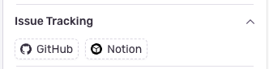

# Sentry-Notion Integration

This integration supports linking sentry issues with a notion database. Written in python, it supplies a dockerfile that can run a microservice fastapi application which exposes a few endpoints for sentry to use to communicate with notion.

## Functionality

### Issue link in Sentry

Issue tracking in Sentry


### Creating Notion Issues

Users can create new Notion database entries directly from Sentry issues.


### Linking Existing Issues

Users can link existing Notion database entries to Sentry issues.


### Notion database


## Deployment

### Prerequisites

- Redis: A Redis server is required for caching database metadata and user information.
- Sentry: A Sentry internal integration
- Notion: A Notion integration

### Sentry setup

Follow the directions for setting up a [Sentry internal integration](https://docs.sentry.io/organization/integrations/integration-platform/internal-integration/). Store the client secret, to be provided in the `SENTRY_NOTION_INTEGRATION_CLIENT_SECRET` environment variable.

Copy paste the contents of the `sentry_ui_schema.json` file into the Sentry UI schema editor within the Sentry app.

After your application is deployed, provide its URL under Webhook URL in the Sentry app.

### Notion setup

Follow the directions for setting up a [Notion integration](https://developers.notion.com/docs/create-a-notion-integration). Store the integration token, to be provided in the `NOTION_TOKEN` environment variable.

Find your database id, to be provided in the `NOTION_CONFIG` environment variable. To find your database id, see [Notion's api docs](https://developers.notion.com/reference/retrieve-a-database).

The integration assumes you have a Notion database set up with the following columns:
- `ID` (type: unique_id)
- `Assignee` (type: people)
- `Sentry Link` (type: url)

If you have different names for your columns, you can provide them in the `NOTION_CONFIG` environment variable.

Note: You will need to give your notion integration access to your database. This is found in the database settings under "Connections".

### Deployment

Build the provided Dockerfile and push it to your container registry. Then, deploy the application to your preferred platform, providing the required environment variables and ensuring the application can connect to the redis server.

## Configuration

### Environment Variables

The integration requires the following environment variables to be set.

- `NOTION_TOKEN`: The notion API integration token.
- `NOTION_CONFIG`: JSON configuration for the Notion database (see below)
- `SENTRY_NOTION_INTEGRATION_CLIENT_SECRET`: The client secret for validating Sentry requests.

The application also provides the following environment variables:

- `CACHE_TIMEOUT`: The cache timeout in seconds (default: 21600)
- `REDIS_HOST`: The Redis host (default: `redis`)
- `REDIS_PORT`: The Redis port (default: `6379`)

### Notion Configuration

The `NOTION_CONFIG` environment variable should contain a JSON object with the following structure:

```json
{
  "database_id": "your-notion-database-id",
  "column_names": {
    "assignee": "notion-people-property-name",
    "id": "notion-unique-id-property-name",
    "sentry_url": "notion-url-property-name"
  }
}
```

The `NOTION_CONFIG` environment variable is used to map between the Notion database columns and the properties we want to use in the integration. The property names should match the names of the properties in the Notion database. Changes to the property names in the Notion database will require updating the `NOTION_CONFIG` environment variable.

## Authentication

All requests from Sentry are authenticated using HMAC signature validation. The integration verifies that requests are coming from Sentry by checking the `sentry-hook-signature` or `sentry-app-signature` headers against the `SENTRY_NOTION_INTEGRATION_CLIENT_SECRET`. This secret is found on the Sentry integrations settings page.

## Caching

The integration uses Redis to cache Notion database metadata and user information to improve performance and reduce API calls to Notion. The cache timeout is set to 6 hours by default but can be adjusted using the `CACHE_TIMEOUT` environment variable.

## Sentry UI Integration

The `sentry_ui_schema.json` file defines the UI components that appear in the Sentry interface. Changes to this file need to be copy pasted into the Sentry UI schema editor within the Sentry app.

## Development

### Environment

Set your environment variables in the `.env` file.

### Commands

#### Run the application

`docker-compose up`

#### Run tests

`uv run pytest`

#### Run type checks

`uv run mypy src`

#### Run tests

`uv run pytest`

### Ngrok

To test sentry requests to your application while developing locally, you can use ngrok. Run an ngrok tunnel and modify the webhook URL in the Sentry app to use the ngrok URL.
